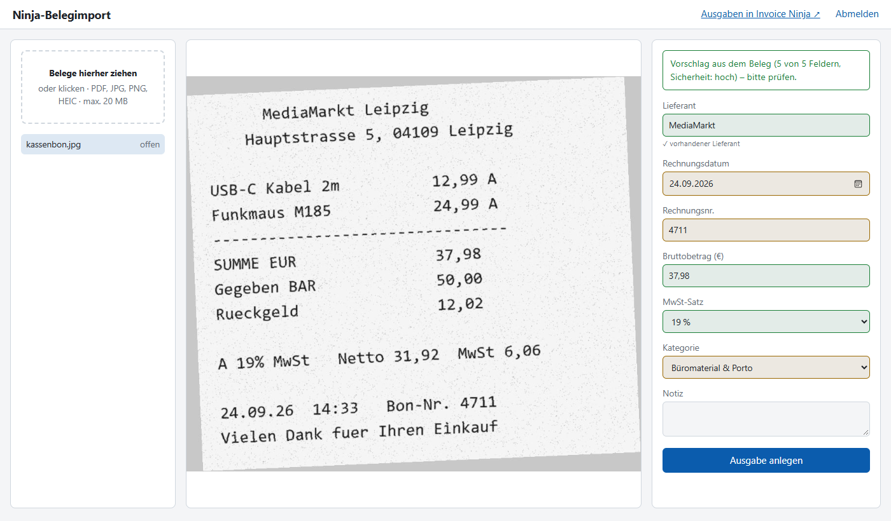

# Ninja-Belegimport

**Belege per Drag & Drop als Ausgaben in [Invoice Ninja](https://invoiceninja.com) v5 buchen – mit lokaler Texterkennung, ohne Cloud.**

Du ziehst PDFs, Handyfotos oder Kassenbons in den Browser. Die App liest Lieferant, Datum, Bruttobetrag,
MwSt-Satz und Rechnungsnummer aus, du prüfst und klickst „Ausgabe anlegen“. Pro Beleg entsteht eine
Ausgabe (Expense) in Invoice Ninja, der Beleg hängt als Dokument dran, und das Original wird zusätzlich
lokal archiviert.

> **Warum nicht der eingebaute Weg?** Invoice Ninja (self-hosted) kann Belege per E-Mail annehmen und
> per OCR auslesen – dafür braucht es aber einen Mail-Dienst (Mailgun/Brevo) und den Cloud-OCR-Dienst
> Mindee, und die Ausgabe wird ohne Prüfung angelegt. Ninja-Belegimport liest **lokal** aus, braucht
> keinen Mail-Dienst, zeigt jeden Vorschlag **vor** dem Speichern und warnt vor Dubletten – über die
> offizielle API, ohne Änderungen an Invoice Ninja.



*Ninja-Belegimport ist ein unabhängiges Projekt und nicht mit Invoice Ninja verbunden oder von Invoice Ninja unterstützt.*

## Funktionen

- **Drag & Drop** für PDF, JPG, PNG und HEIC (iPhone), mehrere Belege nacheinander
- **Lokale Auslese** mit Tesseract-OCR bzw. der Textschicht von PDFs – Belege verlassen den Server nie
  - Bruttobetrag wird gegen Netto + MwSt im Beleg gegengerechnet (fängt OCR-Ziffernfehler ab)
  - Lieferant wird mit den Lieferanten in Invoice Ninja abgeglichen, Kategorie vom letzten Beleg übernommen
  - Werte sind nur Vorschläge, farblich markiert (grün = sicher, gelb = prüfen) – gespeichert wird nur per Klick
- **Zahlung**: „Bereits bezahlt“ mit Datum und Zahlungsart (Überweisung, Lastschrift, PayPal, EC, Karte, Bar …).
  Die Auslese erkennt Kassenbons, Kartenbelege, Online-Rechnungen und Lastschrift-Hinweise und schlägt es vor –
  wichtig für die EÜR, wo eine Ausgabe im Jahr der Zahlung zählt
- **Dubletten-Warnung**: gleiche Datei, gleiche Rechnungsnummer oder gleicher Betrag am selben Tag –
  geprüft im Archiv *und* in Invoice Ninja
- **GoBD-freundliches Archiv**: unverändertes Original unter `data/belege/JJJJ/MM/` plus JSON mit
  SHA-256, Werten und Ausgaben-Nummer
- HEIC wird für Invoice Ninja in JPG umgewandelt, große Fotos werden verkleinert (Original bleibt)
- Auf deutsche Belege zugeschnitten: 19 % / 7 % / 0 %, § 19 UStG, Reverse Charge, „Rechnungsbetrag“ & Co.

**Sicherheit:** Login mit scrypt-Passworthash, Sperre nach 5 Fehlversuchen, CSRF-Schutz, strikte
Content-Security-Policy, Dateityp-Prüfung am Inhalt, 20-MB-Limit. Container läuft ohne Root, mit
schreibgeschütztem Dateisystem und ohne Capabilities. API-Token nur in `.env`, nie im Log.

> Die Auslese ist eine Heuristik, keine KI. Bei sauberen PDFs und gut lesbaren Fotos trifft sie die
> meisten Felder; bei schlechten Fotos bleiben Felder leer statt falsch befüllt. Prüfe jeden Vorschlag.

## Voraussetzungen

- Linux-Server mit Docker und Docker Compose
- Invoice Ninja v5 (selbst gehostet oder Cloud) mit API-Token
- Reverse Proxy mit HTTPS (nginx, Caddy, Plesk …) – die App lauscht nur auf `127.0.0.1:8013`

## Installation

```sh
git clone https://github.com/beerjunky/invoiceninja-belegimport.git
cd invoiceninja-belegimport
cp .env.example .env && chmod 600 .env
mkdir -p data/belege
```

`.env` ausfüllen: `NINJA_URL`, `NINJA_TOKEN`, `APP_USER`, `SECRET_KEY`, `OWN_NAMES` (deine Firma) und
`APP_UID`/`APP_GID` (Ausgabe von `id -u` / `id -g`).

Invoice Ninja hat kein eigenes Feld für die **Rechnungsnummer des Lieferanten**. Lege dafür unter
*Einstellungen → Benutzerdefinierte Felder → Ausgaben* ein Feld an (z. B. „Rechnungsnr. Lieferant“).
Die App schreibt standardmäßig in Feld 1 (`INVOICE_NUMBER_FIELD=custom_value1`).

Dann Passwort setzen und starten:

```sh
python3 set_password.py      # fragt das Passwort ab (min. 16 Zeichen) und trägt den Hash in .env ein
docker compose up -d --build
curl -s http://127.0.0.1:8013/healthz   # {"status":"ok"}
```

### Reverse Proxy

Die App lauscht nur auf `127.0.0.1:8013` und braucht einen Reverse Proxy mit **HTTPS** davor.
Ohne HTTPS klappt der Login nicht: Das Sitzungs-Cookie wird absichtlich nur verschlüsselt übertragen
(`COOKIE_SECURE=1`). Nur für lokale Tests darf `COOKIE_SECURE=0` gesetzt werden.

#### nginx

```nginx
location / {
    proxy_pass http://127.0.0.1:8013;
    proxy_set_header Host $host;
    proxy_set_header X-Forwarded-For $remote_addr;
    proxy_set_header X-Forwarded-Proto $scheme;
    client_max_body_size 25m;
    proxy_read_timeout 120s;
}
```

`X-Forwarded-For` bitte **überschreiben** (wie oben), nicht anhängen – die Login-Sperre arbeitet pro IP.

#### Plesk

Subdomain anlegen, Let's Encrypt aktivieren, unter „Apache & nginx“ den Proxy-Modus aus und den
nginx-Block oben bei „Zusätzliche nginx-Anweisungen“ eintragen.

#### Caddy

Caddy holt das Let's-Encrypt-Zertifikat automatisch:

```
belege.example.com {
    request_body {
        max_size 25MB
    }
    reverse_proxy 127.0.0.1:8013
}
```

#### Nginx Proxy Manager

Nginx Proxy Manager läuft selbst in Docker und erreicht `127.0.0.1` des Hosts nicht. Hänge die App
deshalb zusätzlich in das Docker-Netzwerk von Nginx Proxy Manager (Name z. B. per `docker network ls`):

```yaml
# docker-compose.override.yml
services:
  app:
    networks: [default, npm]
networks:
  npm:
    external: true
    name: npm_default   # Netzwerk deines Nginx Proxy Managers
```

Dann in Nginx Proxy Manager einen **Proxy Host** anlegen:

- *Domain Names:* `belege.example.com`
- *Scheme:* `http`, *Forward Hostname:* `ninja-belegimport`, *Forward Port:* `8000`
- *SSL:* „Request a new SSL Certificate“ und „Force SSL“ aktivieren
- *Advanced:* `client_max_body_size 25m;`

### Backup

Sichere `data/` zusammen mit deinem Invoice-Ninja-Backup. Dort liegen die Originalbelege.

## Konfiguration

| Variable | Bedeutung |
|---|---|
| `NINJA_URL`, `NINJA_TOKEN` | Invoice-Ninja-Instanz und API-Token |
| `APP_USER`, `APP_PASSWORD_HASH` | Login (Hash via `set_password.py`) |
| `SECRET_KEY` | Sitzungsschlüssel, min. 32 Zeichen |
| `EXTRACTOR` | `tesseract` (Standard) oder `none` (nur manuelle Eingabe) |
| `INVOICE_NUMBER_FIELD` | benutzerdefiniertes Ausgaben-Feld für die Lieferanten-Rechnungsnr. (`custom_value1`…`4`) |
| `OWN_NAMES` | eigene Firmennamen, kommagetrennt – nie als Lieferant vorgeschlagen |
| `APP_UID`, `APP_GID` | Host-User, dem `./data` gehört |
| `COOKIE_SECURE` | `1` (Standard); `0` nur für lokale Tests ohne HTTPS |

## Verhalten im Detail

- Betrag = Brutto, `uses_inclusive_taxes=true`, Steuer „USt“ 19 % / 7 % oder 0 %; Rechnungsnummer → benutzerdefiniertes Feld
- „Bereits bezahlt“ → `payment_date` + `payment_type_id`; `transaction_reference` bleibt frei für die Zahlungsreferenz
- Neue Lieferanten bekommen das Land der eigenen Firma aus Invoice Ninja
- Unbekannter Lieferant wird in Invoice Ninja angelegt
- Upload schlägt fehl → Ausgabe bleibt bestehen und wird intern mit „BELEG FEHLT“ markiert
  (Invoice Ninja vergibt Nummern fortlaufend; Löschen wäre nur ein Soft-Delete mit verbrauchter Nummer)
- Invoice Ninja nicht erreichbar → nichts wird angelegt, Beleg liegt trotzdem im Archiv
- `python3 trefferquote.py` wertet aus, wie oft die Vorschläge den gespeicherten Werten entsprachen

Mehr zu den Eigenheiten der Invoice-Ninja-API: [docs/invoice-ninja-api.md](docs/invoice-ninja-api.md)

## Entwicklung

```sh
pip install -r requirements.txt
python -m unittest discover -s tests          # Parser-Tests, ohne Tesseract
SECRET_KEY=$(python -c "import secrets;print(secrets.token_urlsafe(48))") NINJA_URL=... NINJA_TOKEN=... \
  APP_USER=admin APP_PASSWORD_HASH='...' DATA_DIR=./data/belege COOKIE_SECURE=0 EXTRACTOR=none python app.py
```

Die Auslese-Logik steckt in `extractors/parse.py` (reine Heuristik, ohne Abhängigkeiten, gut testbar),
die Texterkennung in `extractors/tesseract.py`. Neue Beleg-Typen am besten als Testfall in
`tests/test_parse.py` beisteuern.

## Einrichtung & Support

Du willst die App nicht selbst aufsetzen oder brauchst Hilfe? **CG-SEC** übernimmt Einrichtung
(Server, Docker, Reverse Proxy, TLS, Invoice-Ninja-Anbindung, Backup) und Support:
**[cg-sec.de/ninja-belegimport](https://cg-sec.de/ninja-belegimport/)**

Fehler und Vorschläge gern als [GitHub-Issue](https://github.com/beerjunky/invoiceninja-belegimport/issues).
Sicherheitslücken bitte nicht öffentlich melden, siehe [SECURITY.md](SECURITY.md).

## Lizenz

MIT – © 2026 Cornell Gräfe (CG-SEC). Siehe [LICENSE](LICENSE).

---

### English summary

Ninja-Belegimport is a small self-hosted web app that turns receipts (PDF, JPG, PNG, HEIC) into
expenses in Invoice Ninja v5 via its API. Drag & drop, local OCR with Tesseract (no cloud), field
suggestions you confirm before saving, duplicate detection, and a local archive of the original files.
The parser is tuned for German receipts. Docker-based, MIT-licensed. Not affiliated with Invoice Ninja.
